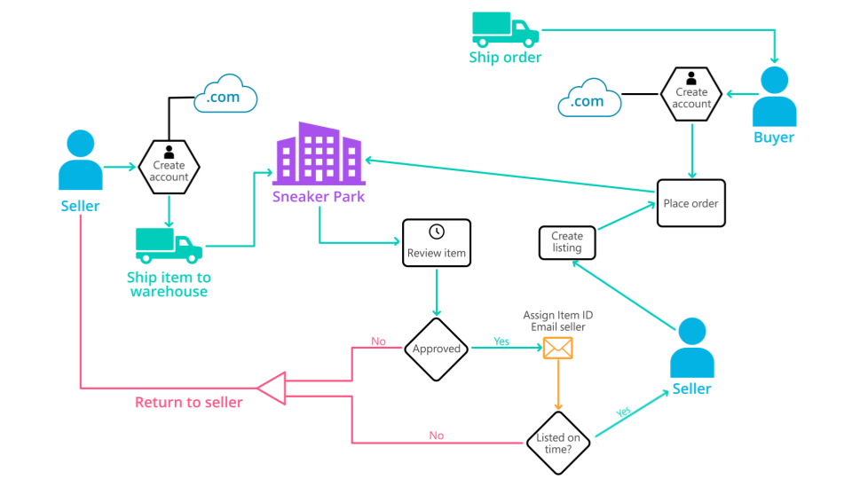
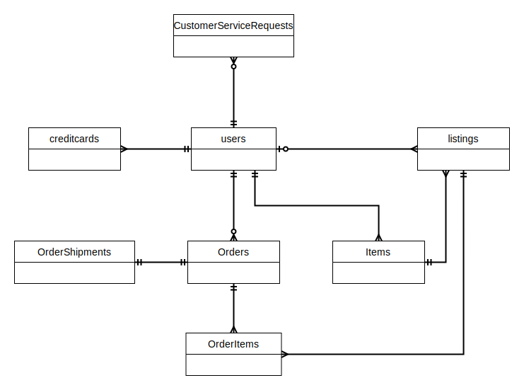
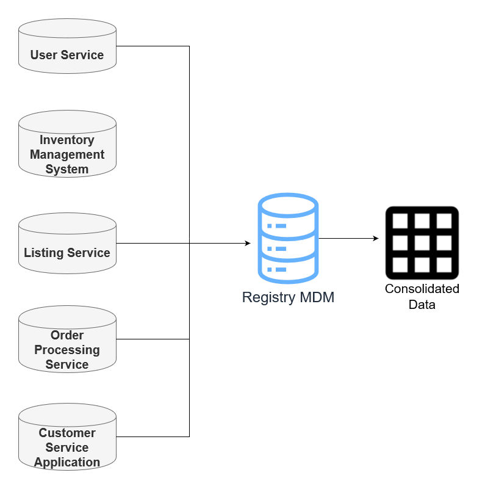
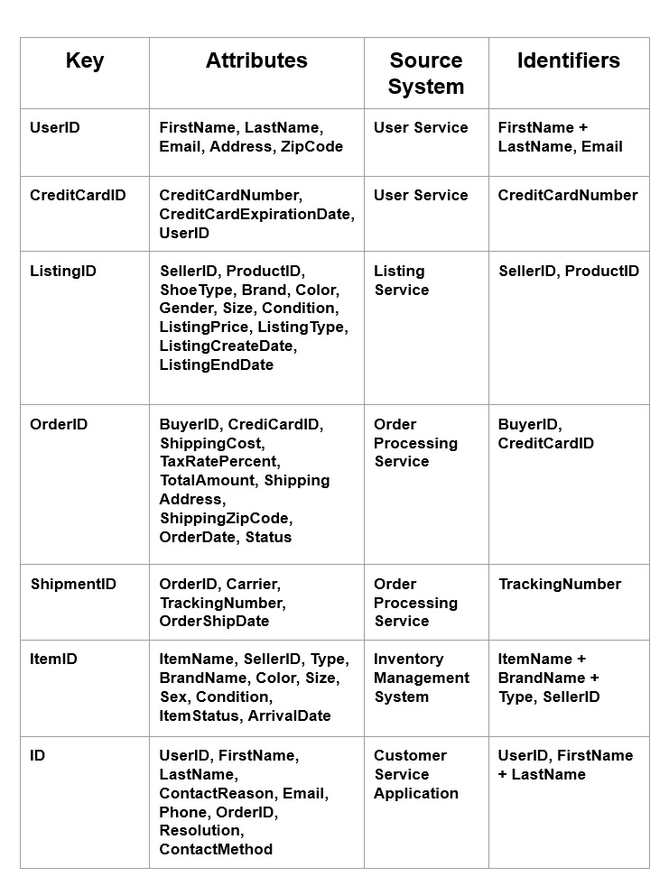

# Data Governance at Sneakerpark

## Overview
SneakerPark is an online shoe reseller that allows people to buy and sell used and new shoes. Buyers can bid for shoes or buy   
them outright, and sellers can set a price or sell to the highest bidder.

Each buyer and seller must have an active account in order to sell, bid, or purchase sneakers using SneakerPark’s website.

SneakerPark authenticates the shoes before shipping them to the buyer, so before listing an item, the seller must ship   
it to SneakerPark’s warehouse. Upon receipt, SneakerPark assigns an item number to each pair of sneakers and notifies the  
seller that they are now free to list their item. If the item is not listed within 45 days, SneakerPark returns the sneakers  
to the seller and sends an invoice to the seller for the shipping cost.

If the item is found to be inauthentic or in an unacceptable condition, it is also returned back to the seller in a similar fashion.

When the item sells, the seller's account is credited with the purchase price minus the SneakerPark service fee and shipping fees   
to deliver the item to the buyer.

  

 SneakerPark's business process 
  

## Objective
SneakerPark would like to implement foundational data management tools and artifacts that will allow it to better manage its  
data now and in the future. This entails documenting SneakerPark's data systems, setting up a data catalog, designing   
better data quality and master data management processes, and formalizing data governance roles.

## Steps
1. Creation of an Enterprise Conceptual Model that provides a holistic view of data.
2. Draft version of Enterprise Data Catalog by documenting the metadata in an excel sheet.
3. Data Profiling to identify 3 data quality issues, and the creation of a document that lists data quality issues, it's  
description and suggested remediation strategy for each.
4. Design of a data quality dashboard that will report on the issues identified, along with 1 more issue that might occur in the future.
5. A proposed MDM implementation architecture, with a detailed explanation of the reasons behind the choice for this approach.
6. Listing a set of matching rules that will be used by SneakerPark's MDM Hub to match item and customer entities between the company's different systems.
7. Outlining of the data governance roles and responsibilities will be necessary to oversee this new Data Management initiative.

  

Enterprise Conceptual Model  

  
  
Registry MDM Architecture  

  

MDM Database Structure  

Relevant files for review are sneakerpark-governance.pptx and sneakerpark-data.xlsx

## Changelog
1.1 Review 20/09/2022 : 
Update enterprise conceptual model to fix missing links between OrderItems and Listings  
Update sneakerparkdata to show rowid of relevant missing data columns
